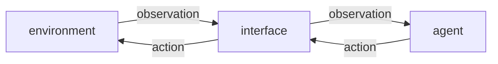

# Basic concepts

We start this journey by defining the two main object that we are going to use
in our experiments. Our aim is to design such objects as general as possible,
so that we can use the same structure for different environments, implement different
algorithms and test different situations.

The main objects are: an environment and a set of agents.
The **environment** represents the part of the world that we are interested to,
it can be either a very simple or a very complex simulation, or even a part
of the real world. An environment **contains** a set of **agents** and is
responsible to keep track of the natural changes that occurs, as well as the
changes due to the actions of the agents. An environment usually includes the
representation of an internal state, that include also the state of the single
agent living within.
The **agents**, often only one in most of the experiments, are entities that
live in the environment and are able to interact with it. In particular, the
agents are provided with a set of **observations** that are taken from the environment,
and can take choices and modify the environment using their **actions**.

The interface between the agents and the environment in which they live is provided
by an **environment interface** that is responsible to provide the observations
to the agents and to communicate to the environment the actions that the agents
want to perform.



All experiments will be performed using discrete time steps, where in each time
step the agents are provided with their observations and return their intended
actions, and the environment is responsible to keep track of the changes in its
state.

In pseudo-Python code, every experiment will have this structure:
```python
env = AnEnvironment()
agent = AnAgent()
interface = AnInterface(env, agent)

env.reset()
while not experiment_finished():  # this could be either a predefined time or will stop if a particular condition is met
  agent.step()
  env.step()
```

where the step of the agent is something like:
```python
class AnAgent:
  def step(self):
    obs = self.interface.observe()
    act = self.compute_action(obs)
    self.interface.act(act)
```

In more advanced experiments, the environment is an external process, a simulator,
or even a real robot. In that case, the Python code does not take care of running it
and the code simplifies to:
```python
simulator_connection = ...

agent = AnAgent()
interface = AnInterface(simulator, agent)

while not experiment_finished():
  agent.step()
```
