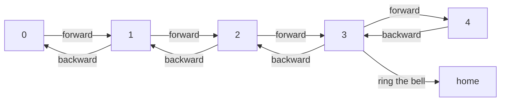

# The "street" environment

Let's start our journey with a very simple environment. This environment represents
a street and is made up 5 "places", every place is represented as a number
between 0 and 4. There is only one agent in this environment and is spawned
in a random place. The place labeled with 3 is special: it is the home of the
agent. The agent wants to enter his home. At every step, he can choose among
three actions: **forward** will move it to the next place, **backward** will move
it to the previous place and **ring the bell** allows to ring the bell of
his home, hoping that someone will open the door.

We can represent this environment and the actions as a simple state machine:



We can then inherit from the basic classes to have the concrete classes for the
street environment:

```py linenums="68" title="000c-street.py"
--8<-- "journey/000c-street.py:68:123"
```

